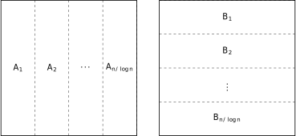
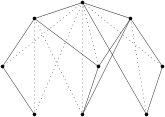

# Method of Four Russians

The [method of four Russians](https://en.wikipedia.org/wiki/Method_of_Four_Russians) is a simple algorithm for boolean matrix multiplication with many applications. The [original paper](https://minorfree.github.io/FourRussian/) is only 2 pages but quite dense. The best explanation of the algorithm I've seen is from _The Design and Analysis of Computer Algorithms_ by Aho, Hopcroft, and Ullman, but they only go over the matrix multiplication part without explaining the application to transitive closure computation from the original paper. I go over both topics in this post, while filling in some holes in the textbook. 

## Multiplying Boolean Matrices

Consider the problem of multiplying two boolean matrices $AB$, where $\times$ is the logical AND and $+$ is the logical OR. For simplicity assume the matrices are square, and the dimension is a power of 2. 

First partition the matrices as shown below, where each $A_i$ is $n \times \log(n)$, and each $B_i$ is $\log(n) \times n$. We can then calculate $AB$ by summing together each $A_i B_i$: $AB = \sum_{1\leq i \leq n/\log(n)} A_i B_i$. 

To compute $A_i B_i$, we multiply $B_i$ by each row of $A_i$ to get a row in the output. For example, multiplying the first row of $A_i$ below with $B_i$ produces the first row in $C_i$. Because we are working with boolean matrices, to perform the multiplication we can just check for which bits of the row in $A_i$ are one, then add together the corresponding rows from $B_i$. For example, the first row of $A_i$ only has the last bit as 1, so we simply return the last row of $B_i$. 

$$
\begin{array}{cc}
    &
    B_i 
    \begin{bmatrix}
    0 & 1 & 0 & 1 & 1 & 0 & 0 & 1 \\
    0 & 0 & 0 & 1 & 0 & 1 & 0 & 0 \\
    1 & 1 & 0 & 1 & 0 & 0 & 0 & 0
    \end{bmatrix}
  \\[2ex]
  \\[2ex]
    A_i 
    \begin{bmatrix}
    0 & 0 & 1 \\
    1 & 0 & 1 \\
    1 & 1 & 1 \\
    1 & 0 & 0 \\
    0 & 0 & 0 \\
    1 & 1 & 0 \\
    0 & 0 & 0 \\
    0 & 1 & 1
    \end{bmatrix}
    &
    C_i 
    \begin{bmatrix}
    1 & 1 & 0 & 1 & 0 & 0 & 0 & 0 \\
    1 & 1 & 0 & 1 & 1 & 0 & 0 & 1 \\
    1 & 1 & 0 & 1 & 1 & 0 & 0 & 1 \\
    0 & 1 & 0 & 1 & 1 & 0 & 0 & 1 \\
    0 & 0 & 0 & 0 & 0 & 0 & 0 & 0 \\
    0 & 1 & 0 & 1 & 1 & 0 & 0 & 1 \\
    0 & 0 & 0 & 0 & 0 & 0 & 0 & 0 \\
    1 & 1 & 0 & 1 & 0 & 1 & 0 & 0
    \end{bmatrix}
\end{array}
$$

Now comes the kick: because $A_i$ only has $\log(n)$ columns, it can have at most $n$ distinct rows. So instead of explicitly multiplying each row with $B_i$, we precompute all possible products of $B_i$ with any row of length $\log(n)$ in a table indexed by the row, then simply look up the result from this table as we iterate through the rows in $A_i$. 

We can do this precomputation in $O(n^2)$ time as follows. Treat each row as a binary encoding of an integer, and iterate over them in increasing order, i.e. $[0,0,0], [0,0,1], [0,1,0], [0,1,1], [1,0,0], \ldots$ The key observation is that, if we iterate over the rows in this order, every new row differs from an already visited row only by one bit (the highest bit $j$). Therefore we can just lookup the product computed for the old row, then add the $j$-th row from  $B_i$ to it. The figure below shows the product of $B_i$ with all possible rows of length 3. Also note that each row happens to be the binary encoding of its position in the table, so when we need to compute the product for a row in $A_i$, we can just treat that row as a binary number and lookup the result. 

$$
\begin{array}{cc}
    &
    B_i 
    \begin{bmatrix}
    0 & 1 & 0 & 1 & 1 & 0 & 0 & 1 \\
    0 & 0 & 0 & 1 & 0 & 1 & 0 & 0 \\
    1 & 1 & 0 & 1 & 0 & 0 & 0 & 0
    \end{bmatrix}
  \\[2ex]
  \\[2ex]
    T_i 
    \begin{bmatrix}
    0 & 0 & 0 \\
    0 & 0 & 1 \\
    0 & 1 & 0 \\
    0 & 1 & 1 \\
    1 & 0 & 0 \\
    1 & 0 & 1 \\
    1 & 1 & 0 \\
    1 & 1 & 1
    \end{bmatrix}
    &
    C_i 
    \begin{bmatrix}
    0 & 0 & 0 & 0 & 0 & 0 & 0 & 0 \\
    0 & 1 & 0 & 1 & 1 & 0 & 0 & 1 \\
    0 & 0 & 0 & 1 & 0 & 1 & 0 & 0 \\
    0 & 1 & 0 & 1 & 1 & 1 & 0 & 1 \\
    1 & 1 & 0 & 1 & 0 & 0 & 0 & 0 \\
    1 & 1 & 0 & 1 & 1 & 0 & 0 & 1 \\
    1 & 1 & 0 & 1 & 0 & 1 & 0 & 0 \\
    1 & 1 & 0 & 1 & 1 & 1 & 0 & 1
    \end{bmatrix}
\end{array}
$$

Precomputing the result for each $B_i$ takes $O(n^2)$ time, and because there are $n/\log(n)$ blocks in total, overall the precomputation takes $O(n^3/\log(n))$ time. 

Multiplying each $A_i$ with $B_i$ involves $n$ lookups, one for each row in $A_i$, taking a total of $O(n^2)$ time. And because there are $O(n/\log(n))$ blocks of $A_i$, we can compute $AB$ in overall $O(n^3/\log(n))$ time. It is easy to generalize this algorithm to rectangular matrices, which is needed for the transitive closure computation below. Also note that unlike other fast matrix multiplication algorithms like Strassen's Algorithm, the algorithm described above can be implemented very efficiently using $O(n^2/\log(n))$ bit vector operations. 

## Computing the Transitive Closure of a DAG

First stratify the input DAG where each stratum $K_i$ contains vertices at depth $i$ (the original paper says to *partition* into *ranks* $K_i$). Here, depth is measured by the *longest* path from the root to the vertex. Intuitively, we can layout the DAG in the "natural" way, where each node is strictly below its "parent". The original paper cites a paper by Faradžev to perform the stratification in $O(n^2)$ time. 
Then, define each $S_i$ to be the union of all $K_j$ with $j \leq i$, i.e. $S_i$ contains all nodes in the first $i$ levels. 
The figure below shows a stratified DAG (dotted edges are from the transitive closure). $K_0$ contains the unique root, 
$K_1$ contains the two nodes below it, $K_2$ contains the three nodes below $K_1$,
and $K_3$ contains the three leaves.

Define $\gamma_i$ to be the edges pointing from vertices in $S_{i-1}$ to vertices in $K_i$, and $\Gamma_i$ to be the edges in the transitive closure pointing from $S_{i-1}$ to $K_i$. Note that because of the way we have stratified the DAG, *any* edge (either in the original DAG or its transitive closure) pointing to a vertex in $K_i$ must come from a vertex strictly higher, i.e. $\in S_{i-1}$. 
So we can just understand $\gamma_i$ as all DAG edges pointing to $K_i$
and $\Gamma_i$ as all edges in $\Gamma$ pointing to $K_i$.
Now the idea is that we will compute $\Gamma$ stratum by stratum.

Define $G_i=\bigcup_{j \leq i} \Gamma_j$, which contains edges in the transitive closure that points from $S_{i-1}$ to $S_i$. To see this, consider any vertex $v$ at level $K_j$. Because of stratification, any edge $e$ pointing to $v$ must come from a node $u$ above $v$ which means $u \in S_{i-1}$, and therefore $e\in \Gamma_j$. 

We can then compute $G$ recursively as follows (the final $G$ is $\Gamma$): 

$$G_0 = \empty \qquad\Gamma_i = \gamma_iG_{i-1} \cup \gamma_i \qquad G_i = G_{i-1} \cup \Gamma_i$$

To see this, recall $\Gamma_i$ contains all transitive edges from $S_{i-1}$ to $K_i$. This can be partitioned into two parts: those pointing from $S_{i-2}$ to $K_i$, and those pointing from $K_{i-1}$ to $K_i$ (because $S_{i-1} = S_{i-2} \cup K_{i-1}$). The second part is contained in $\gamma_i$, and we can compute the first part by joining $G_{i-1}$ (which contains all edges from $S_{i-2}$ to $S_{i-1}$) with $\gamma_i$ (from $S_{i-1}$ to $K_i$). 

If we store $G_i$ and $\Gamma_i$ naively as $n\times n$ matrices, computing $G_{i-1} \cup \Gamma_i$ takes $O(n^2)$ time for each $i$, and because $i$ can be as large as $n$ in the worst case, this would take in total $O(n^3)$ which is no better than simpler algorithms like Floyd-Warshall. The benefit of stratification is that we can just store each $\Gamma_i$ as an $n_i \times n$ matrix where $n_i = |K_i|$, because every edge in $\Gamma_i$ points to some vertex in $K_i$. Similarly, we can store each $G_i$ as a $|S_i| \times n$ matrix where $|S_i| = \sum_{1\leq j\leq i} n_j$. To compute $G_{i-1} \cup \Gamma_i$ we can simply "append" $\Gamma_i$ to the end of $G_{i-1}$. 

Now, the key step is to compute $\Gamma_i=\gamma_i G_{i-1} \cup \gamma_i$. Both $\gamma_i$ and $\gamma_i G_{i-1}$ are $n_i \times n$ matrices, so taking their union (bitwise-or) takes $O(n_i \times n)$ and in total $O(n^2)$ for all $i$. All that remains is to compute $\gamma_i G_{i-1}$, for which we can use the boolean matrix multiplication above in time $O(n^2 n_i / \log n)$, and in total $O(n^3 / \log n)$ for all $i$. 

The [original paper](https://minorfree.github.io/FourRussian/) of Arlazarov, Dinič, Kronrod, and Faradžev show that once we can compute 
the transitive closure of a DAG, we can also compute the transitive closure of a general directed graph by constructing an acyclic [Herz graph/condensation graph](https://en.wikipedia.org/wiki/Strongly_connected_component#Definitions).