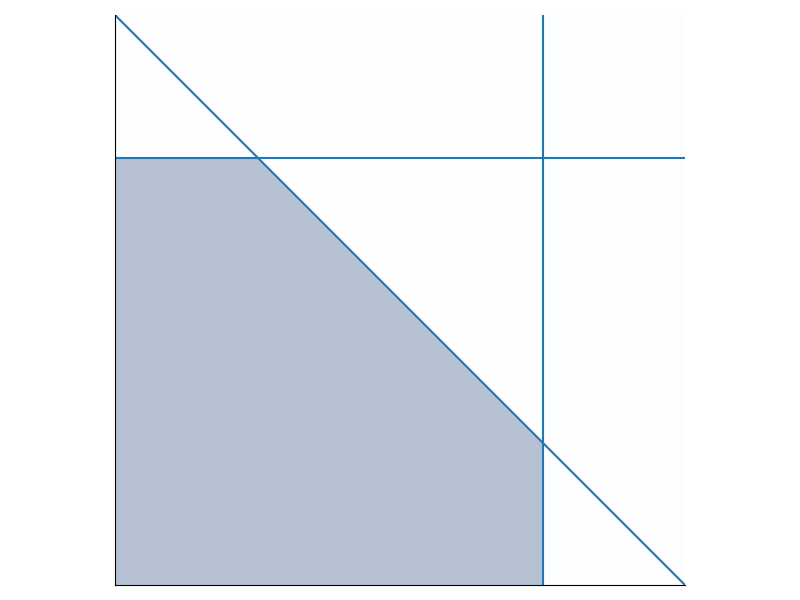

# Duality in Linear Programming

Duality in linear programming relates a pair of linear programs:

**The primal program**:
$$\begin{align*}
\text{maximize: } & \mathbf{c}^\top \mathbf{x} \\
\text{subject to: } & A \mathbf{x} \leq \mathbf{b} \text{ and } \mathbf{x} \geq 0
\end{align*}$$

**The dual program**:
$$\begin{align*}
\text{minimize: } & \mathbf{b}^\top \mathbf{y} \\
\text{subject to: } & A^\top \mathbf{y} \geq \mathbf{c} \text{ and } \mathbf{y} \geq 0
\end{align*}$$

The weak duality theorem says that the minima of $\mathbf{b}^\top \mathbf{y}$
is an upper bound on the maxima of $\mathbf{c}^\top \mathbf{x}$.
The strong duality theorem says that any optima of either program is also the optima of the other program. In other words, the upper bound given by the weak duality theorem is *tight*. In this post I will give a geometric interpretation of the weak duality theorem. 

Let's first visualize a set of linear constraints. Each linear constraint is a (hyper)plane that cuts the space
into halves. In 3D space, a linear constraint is a plane; in 2D, a linear constraint is a line.
The figure below shows 3 linear constraints: $x_1 \leq 2$, $x_1 + x_2 \leq 1.5$, and $x_2 \leq 2$.
Here we also assume $x_1 \geq 0$ and $x_2 \geq 0$.
Given a set of constraints, the *feasible space* contains every point that satisfies all constraints in the set.
This is shown by the shaded area in the figure.

We can therefore think of the primal program as picking a point in the feasible region of the constraints that
maximizes $\mathbf{c}^\top \mathbf{x}$. 
Note that for a given $\mathbf{p}$, $\mathbf{c}^\top \mathbf{x} = \mathbf{p}$ itself is also a line,
so we are basically trying to push this line as far up (and to the right) as possible, as long as it still intersects
the feasible region.
For example, suppose in our 2D case $\mathbf{c}^\top \mathbf{x}$ is just $x_1 + x_2$, 
then the best we can do is $x_1 + x_2 = 1.5$ which coincides with our second constraint.

A crucial concept to understand the dual program is the *linear combination of constraints*.
To linearly combine constraints, we just multiply both sides of each constraint by some number, and add all the left sides
together to get a new left side, and similarly add the right sides.
For example, adding all of our 3 constraints above together gets us $2x_1 + 2x_2 \leq 5.5$, 
which is the same as $x_1 + x_2 \leq 2.75$.
Note that the feasible region of this new constraint contains the entire feasible region of the old constraints, 
and this very important fact is true in general:
let $F$ be the feasible region of a set of constraints $C$, 
and let $c'$ be a linear combination of the constraints in $C$. 
**Then the feasible region of $c'$ is a superset of $F$**.
The proof is simple: consider any point $\mathbf{x}$ in the feasible region $F$.
Then $\mathbf{x}$ must satisfy every constraint $c \in C$. 
Multiplying both sides of a constraint by $k$ does not change the constraint, 
 so $\mathbf{x}$ also satisfies $kc$ for any $k$.
If $\mathbf{x}$ satisfies two constraints $c_1$ and $c_2$, it also satisfies $c_1 + c_2$, 
because if two inequalities $l_1 \leq r_1$ and $l_2 \leq r_2$ both hold, 
$l_1 + l_2 \leq r_1 + r_2$ also holds.
Therefore, $\mathbf{x}$ must satisfy any linear combinations of the constraints in $C$, 
 including $c'$.

Now let's focus on the dual program.
We can understand it as trying to derive an *upper bound* on the maxima of the primal program, 
i.e. of $\mathbf{c}^\top \mathbf{x}$.
The key idea is, **we can derive such an upper bound from a linear combination of the primal constraints**!
This is a natural idea, because our primal constraints already look like upper bounds, 
so all we need to do is to combine them into an upper bound on $\mathbf{c}^\top \mathbf{x}$.
This is where the linear combination of constraints comes in:
we need to assign a weight $y$ to each constraint, add them together, 
so that the left hand side is at least $\mathbf{c}^\top \mathbf{x}$.
But this is exactly the dual constraints $A^\top \mathbf{y} \geq \mathbf{c}$! 
On the right hand side, we now have $\mathbf{b}^\top \mathbf{y}$ which we can use as our upper bound.
It is a *valid* upper bound, because of our little lemma above that
the feasible region of a linear combination of $C$ over approximates the feasible region of $C$ itself.
In addition, we also want this upper bound to be as tight as possible, 
which is why we are minimizing the objective $\mathbf{b}^\top\mathbf{y}$.

In short, the primal program tries to pick a point in the feasible region of the constraints that maximizes the objective.
The dual program tries to derive a tight upper bound on the objective, by linearly combining the primal constraints.
So far we only focused on the weak duality theorem. 
The strong duality theorem involves a bit more work (so it is even more fun), and hopefully we'll get to it in a future post.
