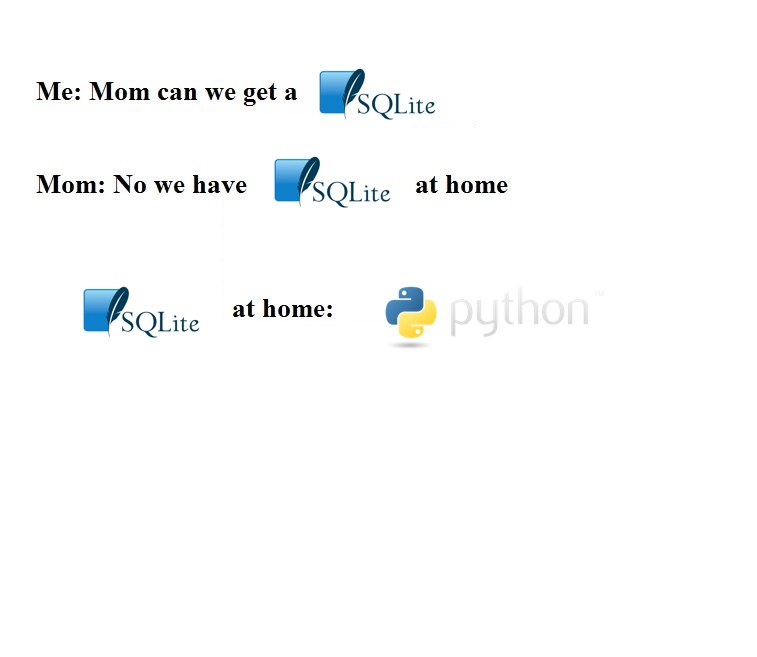

# SQL at home



We spent a lot of time learning SQL, but tbh it's a pretty limited language - it's just a bunch of nested loops! So why don' we just write loops instead? Yes. 

In this homework, we'll do it the hard way and implement "SQL at home". Really we'll try to implement the relational algebra operators. This will solidify our knowledge of relational algebra. As Feynman said, "what I cannot create, I cannot understand". 

Let's start with representing table schema. Recall the schema of a table lists its column names, along with the type of each column. 
As we will be writing Python which is untyped (also pronounced "dynamically typed"), we'll just think about the column names. 
We use **dictionaries** to represent schema as follows: 

```python
p = {
    "name": "casa",
    "age": 8,
    "origin": "seattle",
    "kind": "cat",
    "person": "remy"
}

print(p)
```

Now to get a table of pets, we just have a list of dictionaries:

```python
pets = [
    {
        "name": "casa",
        "age": 8,
        "origin": "seattle",
        "kind": "cat",
        "person": "remy"
    },
    {
        "name": "luna",
        "age": 2,
        "origin": "seattle",
        "kind": "dog",
        "person": "remy"
    },
    {
        "name": "milo",
        "age": 1,
        "origin": "seattle",
        "kind": "dog",
        "person": "remy"
    }
]
```

You might notice a small difference between SQL tables and our hacky version of tables using Python dictionaries:
in SQL, each schema is associated to an entire table, so every row in the table will have the same schema.
In Python, at least the way we're doing it, each "schema" is only attached to one row.
So in theory we could also have added a row with a "person" schema to the `pets` list. We can prevent this by using a
typed language, but let's ignore this for now.

With some data in hand, we can start implementing the relational algebra operators.
Let's start with projection.

* Write a function that takes a list of pets and a column name, and returns a list of the values in that column.

That was a special case of the general projection operator. But before we move to the general case, let's
consider the selection operator.

* Write a function that takes a list of pets and return all the dogs.

In the function above we hardcoded the condition `kind = "dog"`. In general, the selection operator
should take the condition as a parameter. To do that, we need to implement selection as a
[higher-order function](https://en.wikipedia.org/wiki/Higher-order_function).

* Write a function that takes one pet and checks if it is a dog.
* Write a function that takes two parameters: a list of pets and a function of type `Dict -> bool`.
  This function should return the list of pets that satisfy the condition defined by the function.

Now we can implement the general projection operator.

* Write a function that takes a list of pets and a function `f` of type `Dict -> T` for any `T`.
    This function should return a list of the values of `f` applied to each pet.
* Actually, this function is already implemented in Python's standard library. Do you know what it's called?

The next interesting operator is the cartesian product.

* Write a function that takes two lists and returns their cartesian product. You should use the `|` operator
  to merge dictionaries, e.g. `dict1 | dict2`.

Once we have the cartesian product, we can have joins.

* Implement the join operator by combining the cartesian product and the selection operator.

But that's quite an inefficient way to do joins! If we need to join `k` tables each with `n` rows, 
we will have to do `O(n^k)` work to compute the cartesian product.
In practice, joins are implemented using special algorithms.
We will consider a simplified version of the hash join algorithm.
But before that, let's implement a "grouping" operator that will be useful 
for both the hash join and "group by".

* Write a function that takes a list of pets and returns a dictionary mapping 
  each `kind` to a list of pets of that kind.
* Now, generalize that function to take a column name as parameter,
    and return a dictionary mapping each value in that column to a list of pets with that value.
* Generalize the function further so that it can accept a *list* of column names, 
    and implements "group by" on those columns.

The "group by" is in scare quotes, because the output of the function above is not a relation.
It's rather the "first half" of the group by-aggregate operator, before we apply the aggregate function.

* Complete the implementation of group by-aggregate. It should be a function that takes the following parameters:
    - a list representing a table
    - a list of column names to group by
    - one column name to aggregate over
    - a function that takes a list of values and returns a single value

The function should return a dictionary mapping each value in the group by columns to the result of applying the aggregate function to aggregate column.

We'll also use the grouping operator to implement the hash join. Let's start with the simple case.
Suppose we have two tables, `R(x, y)` and `S(y, z)`, and we want to join them on the column `y`.
Let's also assume `S` satisfies the functional dependency `y -> z`.

* Create a dictionary mapping each value of `y` in `S` to the corresponding value of `z`.
* Compute the join of `R` and `S` on `y` by iterating over `R` and looking up the value of `z` in the dictionary.

That's really the spirit of the hash join algorithm: instead of having two nested loops over `R` and `S`, 
we build a hash table for `S` and then do a single loop over `R` to find the matching values.
In general, when there may not be a functional dependency, we need to be careful and keep all possible values of `z` for each `y`.

* Create a dictionary mapping each value of `y` in `S` to a list of values of `z`, such that `(y, z)` is in `S`.
* Compute the join of `R` and `S` on `y` by iterating over `R` and looking up the list of values of `z` in the dictionary.

With this, we're now ready to implement hash join in the general case.

* Write a function that takes two tables and a list of column names to join on.
  The function should return the join of the two tables on those columns.
  The grouping operator will be useful here.

With this, we have implemented the basic operators of relational algebra.
I guess we didn't really need SQL anyways?

* Run some experiments and compare the performance of your implementation with SQLite.
You can generate some large data using Python, or use the crime data set from the last homework.
You can simplify the queries and data a bit so that they can be mapped to the operators we implemented.